# Introduction

In theaters, at parties, concerts or for meditative purposes, e.g. in church, there is a demand for professional lighting to convey or support the desired atmosphere. Often, one wants to create custom light shows for a specific event or application.

This thesis describes the design and build of a feature-rich, inexpensive and open interface between lighting control software on a computer and light fixtures like spotlights, strobe lights, moving heads and scanners. It is built on top of the open-source project *Open Lighting Architecture* running on a Raspberry Pi.

High quality lighting equipment is available from a wide variety of manufacturers and nearly every light fixture is controllable via the [DMX protocol](#sec:dmx-protocol). Traditionally, one uses DMX mixing desks to generate the DMX signal. However, those desk consoles are usually very expensive and therefore not accessible for small associations.

In particular, in our local parish youth, there is a technics team I am part of that arranges sound and lighting engineering for hosted parties and other events in church. Since purchasing full-featured DMX desk would have exceeded the budget, the free version of the PC lighting control software *e:cue*[^ecue] was used instead. The computer running the software is connected to light fixtures via a translator box (*PC-DMX interface*). Unfortunately, this box is still rather pricey and does only accept e:cue's proprietary exchange protocol which is output by their own software.

[^ecue]: <http://ecue.de>

Eventually, in this use case, the software -- being the free version after all -- became too limited: More ideas developed on how to design light shows than the program allowed. There are many different completely free lighting programs that can be tried and compared, but for all the same problem persists: The DMX data must be transmitted to the DMX line bus from the computer with an auxiliary interface.

Additionally, the wish to use a small DMX desk as an input for the software formed, making haptic (instead of mouse-driven) controlling possible. This would allow controlling the speed of a chaser[^chaser] by changing its corresponding hardware fader or triggering a specific function in the software whenever a DMX input channel exceeds a defined level. Another possible use case could be directly forwarding a few DMX channels from the input to the output and letting the software handle all other channels.

[^chaser]: A chaser is a sequence of scenes defined in a lighting software. A scene in turn consists of fixtures set to a certain state; e.g. spotlight 1 is red, spotlights 2 and 3 are off, spotlight 4 is yellow. The program then cycles through those scenes whenever an event occurs (e.g. a button is clicked) or an adjustable amount of time passes.

After a market study, it was clear that such advanced features are not available in any professional yet inexpensive DMX interface. The decision was made to build a PC-DMX interface on my own. It should communicate with the computer over open protocols to allow usage with several different lighting control programs. The core of that box is a Raspberry Pi running an open-source software called *Open Lighting Architecture* (*OLA*) that is able to convert different protocols to and from DMX and process the data internally. This software needs to be extended to fulfill all needs.

This thesis documents the development of the interface from the gathering of requirements and planning the approach, to setting up and extending OLA up until the finished product. All the code improvements and additions I made to the existing project were also contributed back to allow other users to benefit from my work.

##### Structure of this thesis

First, some [technical background](#sec:technical-background) about the required protocols and technologies is given, most notably the DMX and Art-Net protocols, which are needed to understand the goals of the project. Then, the requirements of the PC-DMX interface are analyzed and incorporated into a [system design](#sec:system-design).

Afterwards, the [implementation](#sec:implementation) is presented by outlining the structure and concepts of OLA, which much of this thesis is based on, documenting the electrical and chassis build, and finally describing the code and proceedings for both the DMX output and input plugins.

Subsequently, the implemented features are [validated](#sec:testing) against their specification and an [outlook](#sec:outlook) to future improvements and use is given.


# Technical background {#sec:technical-background}

For this thesis, a basic understanding of some concepts, protocols and specifications is needed. Particularly, it must be clear to the reader how to use DMX hardware and how the low level works technically, so that my programming work can be apprehended. In this chapter, I try to give a sufficient overview about the most important topics.

It is assumed that the reader knows about Raspberry Pi programming and the standard ISO/OSI layer model. It is helpful to already have worked with *git* sometime.

## DMX

*DMX* is used in this paper to refer to the standard *DMX512-A* [@esta-dmx512-a], which is short for "Digital Multiplex with 512 individual pieces of information" [@usitt-faq]. The original standard was defined by the *United States Institute for Theatre Technology* (*USITT*) in 1986 and revised and extended several times. Details of the protocol itself are given in the [next section](#sec:dmx-protocol). First, the general usage of DMX devices is outlined.


### Typical DMX setup

A typical (very simple) DMX lighting setup according to [@bennette-practice] which is shown schematically in [@fig:dmx-line] is as follows: A DMX desk console outputs a DMX signal that is sent via cable to the first light fixture (a simple dimmer in this case). The signal is then looped through to the next fixture, which is a LED head lamp here. The final fixture in this example to be "daisy-chained" is a moving head. Its output DMX signal is not used in another fixture and therefore a terminating resistor (here a black and yellow "stick") finishes the DMX line.

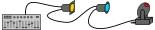{#fig:dmx-line width=100%}

The DMX signal basically consists of 512 integer values between 0 and 255, each representing the value of one channel. Every fixture $f$ in the DMX line listens to a specific number $n_f$ of these channels (fixed by the manufacturer) to control its features. The user now has to give each fixture an address $a_f$ to mark the first channel it has to listen to, e.g. via a DIP switch or a small display on each of the fixtures. The order of the addresses given to the fixtures does not have to match the order of the fixtures in the line.

To show how this works in practice, the example is continued (see also [@tbl:dmx-addresses]): At first, the LED head lamp is given address $a_{LED} = 1$. It needs $n_{LED} = 3$ channels to control its red, green and blue (RGB) components separately, thus listens to channels 1, 2 and 3. To make the LED light yellow, we would need to set channels 1 and 2 (red and green) to 255 and channel 3 (blue) to 0. The next address we can assign without conflict is $a_{LED} + n_{LED} = 4$. We give this address to the dimmer ($a_{dim} = 4$) which needs only this one channel to control its brightness. Now we reserve address 5 for future use of another dimmer, so that the two dimmer channels will be next to each other on the desk console. Finally the moving head is assigned address $a_{mov} = 6$. We assume that its RGB values, pan / tilt movement and gobo wheel[^gobo] can be controlled and therefore 6 channels are needed.

[^gobo]: A gobo is a stencil in front of the lamp that shapes the emitted light beam. Typically, multiple gobos are mounted in a wheel that rotates according to the DMX value in the corresponding channel to allow the selection of one gobo at a time.

Table: Example DMX addresses and channel numbers. {#tbl:dmx-addresses}

-----------------------------------------------------------
fixture       address   number of   controlled channels
                        channels
------------  --------  ----------  -----------------------
LED head      1         3           ch. 1: red

                                    ch. 2: green

                                    ch. 3: blue

###

dimmer        4         1           ch. 4: brightness

###

unused                              ch. 5: --

###

moving head   6         6           ch. 6: red

                                    ch. 7: green

                                    ch. 8: blue

                                    ch. 9: pan movement

                                    ch. 10: tilt movement

                                    ch. 11: gobo wheel

-----------------------------------------------------------

The 512 channels being signalled through one line are called a *DMX universe*. A desk console can output multiple universes, which allows to address more fixtures in total.

Instead of using a physical DMX desk, its task can also be fulfilled by a software. The computer running it is then connected to the DMX line via a physical interface.

#### DMX Splitters and Mergers {#sec:splitters-mergers}

There are two notable hardware components that can be used in a DMX line to make the wiring between fixtures and DMX sources more flexible:

* A DMX splitter is used as a T piece to forward one input signal into two (or more) output lines.
* A DMX merger combines the signals from its two input universes *A* and *B* (seldomly also more) into one output signal. Mergers typically have different modes of operation, such as the following. [@showtec-dmx-merge]
    - *Backup*: As long as *A* is a valid signal, loop it through; else use *B*.
    - *Merge*: Use *A*'s first $x$ channels, then fill the remaining 512 minus $x$ channels with *B*'s first channels.
    - *LTP* ("latest takes precedence"): Loop the universe through that has changed later. Sometimes this algorithm is also applied per channel instead of per universe.
    - *HTP* ("highest takes precedence"): For each of the 512 channels, use the highest value of the both corresponding channels in *A* and *B*.


### DMX protocol {#sec:dmx-protocol}

This section gives a short summary of the official *DMX512-A* standard [@esta-dmx512-a] by the *Entertainment Services and Technology Association* (*ESTA*).

The DMX protocol defines a serial signal (shown in [@fig:dmx-timing]) at a baud rate of 250000 bits per second. It consists of individual packets, each of which is initiated by the *reset sequence* (an arbitrarily long `low` *BREAK* signal followed by the `high` *mark after BREAK* (*MAB*) and slot 0). A slot contains 8-bit data (least significant bit first), prepended by a `low` start bit and followed by two `high` stop bits. The data in slot 0 is called the *start code*, it is always `0x00` for DMX packets. Other start codes can be used to indicate manufacturer-specific information or special functions; those packets shall be ignored by standard DMX receivers, so they are not relevant in this project.

After the reset sequence, the channel values of the universe are transmitted in one slot each. Since channels are transmitted serially, it is possible for fixtures in the DMX line to count received channels and start listening as soon as their address matches the current channel number. The channel number therefore does not have to be transmitted separately. Slots can be separated by a `high` *mark between slots* (*MBS*[^mbs]).

[^mbs]: This abbreviation is not used in the official standard. I introduced it for simpler referencing.

Following the last channel, a `high` *mark before BREAK* (*MBB*) or the next BREAK indicates the end of the packet. At least one packet per second should be transmitted, though faster updates are desirable to ensure fast respondence of the fixtures and, in particular, smooth light fading. To increase the refresh rate, not all 512 channels have to be transmitted in a packet.

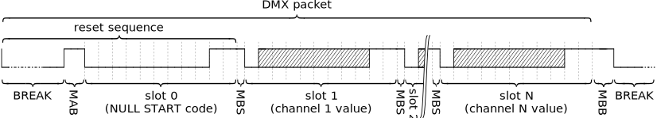{#fig:dmx-timing width=100%}

Table: DMX timing. Values in parenthesis only apply to receivers. From [@esta-dmx512-a] {#tbl:dmx-timing}

---------------------------------------------------------------------
Entity                        Min           Typical         Max
-----------------------  -------------- -------------- --------------
Bit rate                   245kbit/s       250kbit/s      255kbit/s

Bit time                     3.92µs          4µs           4.08µs

###########

BREAK                      92µs (88µs)      176µs           --

MAB                        12µs (8µs)         --          < 1.00s

MBS                            0              --          < 1.00s

MBB                            0              --          < 1.00s

DMX packet                   1204µs           --           1.00s
                            (1196µs)                      (1.25s)

Refresh rate                 830Hz            --        1Hz (0.8Hz)
                            (836Hz)

---------------------------------------------------------------------

If one considers packets with all 512 channels, one can work out from [@tbl:dmx-timing] a minimum packet time of 22.7ms, or a maximum refresh rate of 44Hz.

An extension to DMX that will not be important for this thesis but should still be mentioned is *Remote Device Management* (*RDM*). It allows setting the fixtures' DMX address and other options from the RDM controller, which is an extended DMX desk or software. It works by interleaving the unidirectional DMX signal with bidirectional RDM packets.


#### Electrical specification {#sec:dmx-electrical}

DMX uses the electrical specifications defined in the industry standard EIA-485 (also known as RS-485) which describes balanced transmission-line signaling [@texas-instruments-eia-485]. "Balanced" means data bits are encoded via the potential difference between the twisted-pair cables *Data\ +* and *Data\ –*. This decreases interference liability, since noise adds to both data lines equally -- effectively cancelling itself out in the difference --, and thus makes line lengths of up to 1.2km possible. For DMX lines though, the recommendation is to stay below 300m [@bennette-practice].

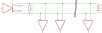{#fig:eia-485-bus width=90%}

In [@fig:eia-485-bus], the electrical schematic of such a bus is shown. On the left, the transmitter converts the raw signal into the differential signal. All the receivers on the bottom (up to 32 are allowed) do the same in the other direction.[^transceiver] At both the near end (transmitter side) and the far end (after last receiver), a termination resistor of 120 ohms is installed to minimize reflections that could interfere with the signal.

[^transceiver]: Actually, all devices connected to the bus are allowed to both transmit and receive (e.g. used in RDM). Thus, usually so-called "bus transceiver chips" that can convert in both directions are deployed. Since communication over DMX will always be uni-directional in this thesis, I simplified the figure.

The DMX standard requires 5-pin XLR connectors, except where they are "physically impossible to mount" [@esta-dmx512-a]. Even so, most DMX hardware is equipped with a 3-pin XLR connector instead or additionally. This is due to the fact that only 3 pins are needed and 3-pin XLR cables are common in event technology because they are also used for microphones.

{#fig:xlr-connectors width=50%}

Table: XLR pin assignment for DMX. {#tbl:xlr-pins}

| Pin Number | 3-pin XLR | 5-pin XLR             |
|:----------:|:---------:|:---------------------:|
| 1          | Ground    | Ground                |
| 2          | *Data –*  | *Data –*              |
| 3          | *Data +*  | *Data +*              |
| 4          | --        | *Data 2 –* (optional) |
| 5          | --        | *Data 2 +* (optional) |


### Art-Net and sACN protocols {#sec:art-net-sacn}

DMX only allows one or two universes per line, which may make cabling impractical in some use cases. To overcome this issue, the English lighting equipment company *Artistic Licence* created a free-to-use DMX over UDP[^udp] protocol called *Art-Net* [@artistic-licence-art-net4] in 1998. It allows sending multiple DMX universes over a standard IP network and thus highly extends the flexibility of lighting systems since a single Ethernet link or a wireless network can be used for large parts of the transport way.

[^udp]: User Datagram Protocol

There are lighting controllers and fixtures that work directly with Art-Net (exclusively or alongside traditional DMX), all others can be connected via an *Art-Net Node* that converts to and from DMX. Often, the protocol is used for communication between a lighting software on a computer and one such Node acting as the DMX source for fixtures, like in [@fig:art-net-node-schematic].

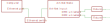{#fig:art-net-node-schematic width=100%}

*Streaming ACN* (*sACN*), which was standardized as ANSI E1.31 in late 2016 [@esta-sacn], is ESTA's open protocol with the same goals and shares most of its high level properties with Art-Net. In this thesis, the details and differences of both protocols will not be covered.


## UART {#sec:uart}

The *Universal Asynchronous Receiver Transmitter* (*UART*) is an interface present on many microcontrollers that allows communication over serial bus lines. There is no extra clock signal, the receiver synchronizes itself through the fixed data format: Data bits are transmitted sequentially, framed in slots with `low` start and `high` stop bits. If the signal is `low` for longer than one slot time, the *break condition* is fulfilled.

Various parameters have to be fixed at both receiver and transmitter to avoid misunderstanding: Baud rate, the number of data bits per slot (usually 5 to 9), bit numbering (most or least significant bit first), the number of stop bits used (one or two) and if each slot should additionally contain a parity bit.

As the [DMX timing protocol](#sec:dmx-protocol) is a specialization of this specification, sending and receiving DMX data via a UART is possible. One caveat though is the non-standard baud rate of 250kbit/s.


## SPI {#sec:spi}

The *Serial Peripheral Interface* (*SPI*) is a synchronous data transmission interface between a master and multiple slave devices designed by Motorola [@dembowski-raspi]. Only the independent slave configuration will be discussed here, which can be seen in [@fig:spi-schematic].

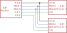{#fig:spi-schematic width=60%}

By applying a `low` signal at one of the *Slave select* / *Chip enable* (*CE*) pins, the master can notify the corresponding slave that it wants to communicate with. After that, the master generates a clock signal at the *SCK* (*Serial clock*) pin and simultaneously reads at the *MISO* (*Master In, Slave Out*) pin and transmits at the *MOSI* (*Master Out, Slave In*) pin one bit per clock cycle. After the data transmission is completed (e.g. one byte is sent to the slave who then may answer with one byte, but that depends on the protocol fixed between the devices), the master resets all pins to their idle levels.

There are multiple SPI modes that define when the bit read / write operation should happen in relation to the clock signal. For simplicity, only mode 0 is shown here, in which *SCK*'s idle status is `low` and data transfer starts with the first rising edge in the clock signal (see [@fig:spi-timing]).

![SPI timing diagram. MSB and LSB are short for *most significant bit* and *least significant bit*, respectively. Adapted from [@dembowski-raspi].](Bilder/spi-timing.svg){#fig:spi-timing width=90%}


# Requirement analysis and system design {#sec:system-design}

In this chapter, the plan for the PC-DMX interface is outlined. First, I will define my [requirements](#sec:requirements) and examine several existing [products on the market](#sec:market-study) on how they match or fail these requirements. This will then lead to the [design](#sec:design) of the interface described in this thesis.


## Requirement analysis {#sec:requirements}

The requirements defined in this section are designed for the specific use case of small associations like technics teams in youth groups (i.e. not professional event management companies or the like). Their budget is usually very limited but their expertise does not have to be -- i.e. the PC-DMX interface must offer features for advanced users while still being affordable.

A youth technics team may not have found its optimum workflow yet and may want to improve it by trying out different free lighting control programs, e.g. QLC+[^qlcplus], DMX Control[^dmxcontrol] or FreeStyler DMX[^freestyler]. The interface should support that by being compatible with as many of them as possible.

Connection to the computer shall be possible via Ethernet to allow extending the cable via standard network equipment like switches, routers and Wi-Fi access points. USB connection is not sufficient because USB devices need special drivers and configuration, which would make the interface less portable, e.g. if a quick replacement computer in an emergency situation is needed. Among the protocols used for data transmission, at least one should be open, i.e. either sACN or Art-Net[^art-net-open] should be supported.

[^qlcplus]: <http://www.qlcplus.org/>
[^dmxcontrol]: <https://www.dmxcontrol.org/>
[^freestyler]: <http://www.freestylerdmx.be/>
[^art-net-open]: Although Art-Net is not strictly open, it is free-to-use and supported by a wide variety of software and hardware.

The interface should support output of at least two DMX universes to be able to address a sufficiently large number of fixtures and input of at least one to allow haptic control of DMX channels using a mixing desk. The method how DMX input signals are handled should be configurable:

* Either the DMX channel values are sent via Art-Net to the control software (default *Art-Net Node*-like mode), e.g. to control software functions with hardware mixing desk faders,
* or it acts like a [DMX splitter](#sec:splitters-mergers), forwarding its DMX input signal on both DMX outputs,
* or the DMX input channels are merged with the channel values provided over the network into one of the output universes using one of the merge modes described in [@sec:splitters-mergers].

All input and output DMX signals should be processed with a high refresh frequency, so that delays remain low and smooth light fading is possible.

Using the interface should be as simple as possible for end-users. That means that neither in-depth knowledge about the DMX protocol or computer networks nor special know-how about this specific interface should be required to use it. However, end-users are assumed to know how to work with DMX software and hardware in general. More complicated functions like the flexible input mapping mentioned above should be trivial enough to be understandable in a short period of time.

The whole setup should cost less than 100€ and be extensible, i.e. widened future requirements like the need for more DMX universes should be easy to implement without a redesign and rebuild of the whole hardware and software.

Additionally, it would be appreciated if both hardware and software were open-source to allow others to extend and improve the interface.


## Market study {#sec:market-study}

A market study was conducted to see how existing products do fulfill the requirements defined in the previous section. The price limit on 100€ was fixed to narrow down the products in the first step. An overview of the products described here is given in [@tbl:market-overview].

Since the price limit of 100€ narrows down the range of professional hardware to various USB-to-DMX adapters and one Art-Net Node by *Eurolite*[^eurolite-art-net-node] -- all of them with support for only one output universe, none with DMX input --, only "Do It Yourself" projects are left.

A popular one, *DMXControl Projects*' *Nodle U1*[^dmxcontrol-nodle-u1], can also only be connected via USB. Thus, it has to be explicitly supported by lighting programs -- which several do. Nevertheless, it fails the network connection requirement.

Some members of the *DMXControl* forum and wiki created an Art-Net Node based on a commercially available AVR construction kit[^dmxcontrol-25-euro]. It was refined and eventually ported to its own hardware to support two DMX universes[^dmxcontrol-board]. Unfortunately, this is still not sufficient.

The same applies to GitHub user *mtongnz*'s Art-Net Node based on the Wi-Fi-enabled *ESP8266* microcontroller[^mtongnz-esp8266].

The project that matches most of my requirements is the *Quad Art Net Box* by Ulrich Radig[^radig-quad]: It supports four DMX output universes, one of them can be toggled to an input. Sources and schematics are available online, and an assembly kit can be ordered. However, there is no information given about whether the DMX input can be flexibly merged into one DMX output universe or if it is always forwarded to the Art-Net output.

Rather than doing all the work in one microcontroller like in the previous projects, *raspberrypi-dmx.org*[^raspi-art-net] uses a much more powerful Raspberry Pi with an additional co-processor on an extension board (sometimes called *shield*) that is plugged into the GPIO (General Purpose Input / Output) pins. Thereby, only the software needs to be replaced (by re-flashing the SD card) to match the use case: USB, Art-Net, sACN, Open Sound Control and MIDI can all be converted to DMX with the correct SD card image. Unfortunately, the extension board hardware does only support one input and one output universe.

[^eurolite-art-net-node]: <https://www.steinigke.de/en/mpn70064842-eurolite-art-net-dmx-node-1.html>
[^dmxcontrol-nodle-u1]: <https://www.dmxcontrol-projects.org/hardware/nodle-u1.html>
[^dmxcontrol-25-euro]: <https://wiki.dmxcontrol.de/wiki/Art-Net-Node_f%C3%BCr_25_Euro>
[^dmxcontrol-board]: <https://wiki.dmxcontrol.de/wiki/ArtNetNode_auf_einer_Platine>
[^mtongnz-esp8266]: <https://github.com/mtongnz/ESP8266_ArtNetNode_v2>
[^radig-quad]: <https://www.ulrichradig.de/home/index.php/dmx/quad-art-net>
[^raspi-art-net]: <http://www.raspberrypi-dmx.org/raspberry-pi-art-net-dmx-out>

Table: arraystretch=2 Available products overview. Values in parenthesis specify alternate modes. {#tbl:market-overview}

--------------------------------------------------------------------------------
Product                      Simultaneous    Flexible    Open /      Connection
                            output / input    input    Extensible        to
                               universes     mapping                  computer
-------------------------- ---------------- --------- ------------ -------------
Professional                1 :x: / 0 :x:     *N/A*      :x: /          USB
USB-to-DMX\ adapters                           :x:       :x:            :x:

Eurolite                    1 :x: / 0 :x:     *N/A*      :x: /        Art-Net
Art-Net/DMX\ Node\ 1                           :x:       :x:            :ok:

DMXControl\ Projects        1 :x: / 1 :ok:            :ok: / :x:        USB
Nodle\ U1                                      :x:    [^nodle-ext]      :x:

DMXControl\ Wiki           2 :ok: / 0 :x:↩    *N/A*      :ok: /       Art-Net
AvrArtNodeV2.0             (0 :x: / 2 :ok:)    :x:       :x:            :ok:

mtongnz                    2 :ok: / 0 :x:↩     :x:       :ok: /       Art-Net
ESP8266\_ArtNetNode\_v2    (1 :x: / 1 :ok:)              :x:            :ok:

Ulrich\ Radig              3 :ok: / 1 :ok:↩    :x:       :ok: /       Art-Net
Quad\ Art\ Net\ Box        (4 :ok: / 0 :x:)              :x:            :ok:

Raspberry Pi↩              1 :x: / 1 :ok:      :x:       :ok: /    Art-Net ↩
Art-Net 3 -> DMX Out                                     :ok:      + others :ok:

--------------------------------------------------------------------------------

[^nodle-ext]: *DMXControl Projects* do state in their manual that "future extensions should be possible"[@dmxcontrol-nodle-u1]. However it seems to me that such extensions would still require completely redesigned hardware.

Another interesting project I have found during my research is the *Open Lighting Architecture* (*OLA*) software, which will be further explained in [@sec:ola]. It aims to be a universal protocol translator for DMX signals, supporting different devices through plugins. It can be installed on the Raspberry Pi and a plugin providing native DMX output through its [UART port](#sec:uart) is already available.

In conclusion, none of the existing products fulfills all requirements, but there are a few different approaches and projects that provide a good starting point for building an PC-DMX interface myself.


## System design {#sec:design}

The single-board computer Raspberry Pi will form the basis of the adapter. It has Ethernet and USB ports and a CPU powerful enough to run OLA. An extension board interfaced to its GPIO pins must be developed. It has to be equipped with two EIA-485 bus transceivers to provide one DMX input and, through the aforementioned UART plugin, one output. The second output will be supplied by an USB-to-DMX adapter that was available to me, the *DMXCreator 512 Basic*[^dmxcreator-512]. Its protocol has to be reverse-engineered and incorporated into OLA's USB plugin (see [@sec:ola-dmxcreator-plugin]). Initial observation of the protocol suggested the feasibility of this approach.

[^dmxcreator-512]: <http://www.dmx512.ch/512.html>

An OLA plugin that allows direct DMX input on the Raspberry Pi is yet to be developed. Initially, I planned to extend the UART plugin. However, prototyping the protocol recognition using the UART port did not succeed, so the SPI bus will be used to sample the DMX signal instead. Further details of this technique are explained in [@sec:ola-spidmx-plugin].

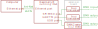{#fig:system-design-schematic width=100%}


# Implementation {#sec:implementation}

In [@sec:system-design], requirements were specified which the desired PC-DMX interface has to fulfill. A market study revealed that no existing products match these requirements, so a system design was developed. This chapter describes the steps I took to implement this design.

First, relevant parts of the *Open Lighting Architecture* (*OLA*) project, which will be used as the software basis, are outlined, before it is initially installed on a Raspberry Pi. Afterwards, the physical extension board and implementation of both required extensions to the OLA software are explained. The build of a chassis completes this chapter.

## The Open Lighting Architecture Project {#sec:ola}

The *Open Lighting Architecture* (*OLA*) project I discovered during my [market study](#sec:market-study) is described in [@lsa-dmx-tester] as

> [...] free, open source software originally created by Simon Newton and now developed by a team of contributors around the world. It runs on Linux or Mac and is capable of interfacing with USB DMX512 hardware, DMX512 over IP protocols, and the Raspberry Pi's GPIO pins. The application includes a web interface for easily creating, monitoring, and configuring DMX universes. OLA is one part of the larger Open Lighting Project, which aims to build high-quality, free software for the entertainment lighting industry.

As it provides the basis of my implementation, I briefly explain some concepts in the project that are needed later.

### Terminology

In OLA, some keywords are used extensively [@using-ola]:

* A *port* is a point where at most 512 DMX channel values are passed to (*output port*) or read in (*input port*). It can either be physical or virtual (like in Art-Net).
* A *device* groups ports together, it consists of at least one port.
* A *plugin* provides support for recognizing, connecting to and communicating with one or more devices. It has to be compiled along with OLA (i.e. cannot be downloaded and connected afterwards) and thus has to be part of the project. At runtime, plugins can be enabled and disabled independently.
* An OLA *universe* is an internal set of 512 DMX channel values. It can be *patched* by the user to input ports to receive new data and / or to output ports to transmit its current channel values.

### Relevant existing plugins

At the time of writing, there are already more than 20 plugins available in OLA's source code. Amongst them, the following are of special interest for this thesis.

#### Art-Net Plugin

The *ArtNet Plugin*[^github-ola-art-net] implements the [Art-Net protocol](#sec:art-net-sacn) version 3, which supports at most four input universes and four output universes per IP address. This plugin creates input ports and output ports accordingly, which can be patched to OLA universes and thereby relay DMX data to / from external lighting programs. Since the Art-Net protocol is designed in a backwards-compatible manner, both newer and older client software are able to communicate with OLA.

This plugin does not need additional hardware, it uses the network ports that are already available.

[^github-ola-art-net]: <https://github.com/OpenLightingProject/ola/tree/master/plugins/artnet>. It is actually not named *Art-Net Plugin* at the time of writing. I opened issue [#1328](https://github.com/OpenLightingProject/ola/issues/1328) on GitHub to fix this.

#### UART Plugin {#sec:ola-uart-plugin}

The *Native UART DMX Plugin*[^github-ola-uart] instantiates one output port that directly generates the [DMX signal](#sec:dmx-protocol) via the [UART port](#sec:uart) of the host device, usually a Raspberry Pi.

This signal at a GPIO pin must then only be run through a bus transceiver chip to transform it into a balanced EIA-485 signal with a valid potential difference.

Richard Ash, the initial author of this plugin, outlines the difficulties he had to face for his implementation in a blog post[^easter-trail]:

* "DMX-512 runs a a [sic] non-standard (for PC) baud rate of 250kbaud."  
  Fortunately, this issue could be solved on Linux by using the `termios2` interface for UART setup.
* "DMX-512 uses serial break signals […]. These cannot be sent by just writing characters out of the serial port."  
  Again, the `termios2` interface provides methods to start and end the BREAK. In between, a standard `usleep` call interrupts the sending thread for the specified time; imprecisions do not matter in this case.
* "DMX-512 has relative tight timing requirements for various elements of the signal – if your computer suddenly stops sending data for a while, then the lights you are controlling may go out or flicker randomly."  
  This is true indeed, however both his own project experience and my testing have proven the output to be reliable enough for smooth light fading.

[^github-ola-uart]: <https://github.com/OpenLightingProject/ola/tree/master/plugins/uartdmx>
[^easter-trail]: <http://eastertrail.blogspot.de/2014/04/command-and-control-ii.html>

#### USB Plugin {#sec:ola-usb-plugin}

The *USB DMX Plugin*[^github-ola-usbdmx] provides support for a variety of USB-to-DMX adapters. Each of them is controlled by a "sub-plugin" that extends the common basis implementation. This simplifies access to the `libusb` library and reduces code duplication.

Each sub-plugin gets notified about a newly plugged in USB device and can claim it if vendor ID, device ID and possibly other information match predefined values. Then, it is responsible for creating ports and communicating with the device.

[^github-ola-usbdmx]: <https://github.com/OpenLightingProject/ola/tree/master/plugins/usbdmx>

#### SPI Plugin {#sec:ola-spi-plugin}

The *SPI Plugin*[^github-ola-spi] allows to directly operate LED pixel strips with [SPI](#sec:spi)-controllable LED drivers like WS2801 or LPD8806[^ola-led-pixels]. Advanced functions like using hardware SPI multiplexers and multiple pixel strips are available but beyond the scope of this explanation.

[^github-ola-spi]: <https://github.com/OpenLightingProject/ola/tree/master/plugins/spi>
[^ola-led-pixels]: see <https://opendmx.net/index.php/OLA_LED_Pixels>


### Project organization with GitHub

The project repository is hosted at GitHub[^github-ola]. Its `master` branch always contains the newest development version, released versions are tagged commits in the git history (like `0.10.5`). For every bigger version change (like from `0.9.x` to `0.10.0`), a version branch is created (`0.10`) that allows future bug fix commits to be targeted against the released version without having to include newer features from the `master` branch.

[^github-ola]: <https://github.com/OpenLightingProject/ola>

Pull requests from contributors' forks are automatically run against the project's tests and linters and have to be approved by both main developers, Simon Newton and Peter Newman. This allows spotting bugs and inconsistencies early and ensures good code quality.


## Initial setup of OLA on the Raspberry Pi

In this section, I explain the steps which were needed to install OLA on a Raspberry Pi 1 model B+ from scratch. Newer versions of the single-board computer should work as well, but may need some slight adjustments.

First, a recent Raspbian Lite image from the Raspberry Pi homepage[^raspi-download] has to be downloaded and flashed[^raspi-flashing] onto the microSD card that the Raspberry Pi will boot from. The microSD card should be at least 4GB in size[^sd-card-size]. Secure shell (SSH) access is disabled by default in Raspbian. Since SSH is required for connecting remotely to the Raspberry Pi, it must be enabled by putting a new (empty) file named `ssh` in the card's root directory.

[^raspi-download]: <https://raspberrypi.org/downloads/raspbian/>. There are also pre-configured OLA images available from <http://dl.openlighting.org/>, but since I need the latest *git* version to apply my own changes and those images were not updated for several years, the manual procedure is the better way.

[^raspi-flashing]: Instructions: <https://raspberrypi.org/documentation/installation/installing-images/README.md>

[^sd-card-size]: I managed to install OLA on a 2GB card, but that required removing various packages and constantly scratching at the space limit. I later switched to a 4GB card.

After booting up the Raspberry Pi with the newly flashed microSD card and connecting it to the network with an Ethernet cable, the IP address has to be found out[^raspi-ip] so that a secure shell can be opened. In this shell, all following commands are executed.

[^raspi-ip]: Instructions: <https://raspberrypi.org/documentation/remote-access/ip-address.md>

Before continuing, all packages, firmware and the kernel should be updated to their latest versions:

``` {style="myBash"}
sudo apt update
sudo apt upgrade
sudo rpi-update
```

### Building and installing OLA

Building OLA from source for the first time takes several hours. Thus, it may be helpful to overclock Raspberry Pi's processor via `raspi-config`; the *Medium* setting worked reliably for me. A reboot is needed for the change to take effect.

Some prerequisite packages are required for building OLA and need to be installed with `apt`. Thereafter, the latest source code from GitHub is downloaded, built and the resulting binaries get copied to the correct paths.

``` {style="myBash"}
sudo apt install git libcppunit-dev libcppunit-1.13-0 uuid-dev pkg-config libncurses5-dev libtool autoconf automake g++ libmicrohttpd-dev libmicrohttpd10 protobuf-compiler libprotobuf-lite9 python-protobuf libprotobuf-dev libprotoc-dev zlib1g-dev bison flex make libftdi-dev libftdi1 libusb-1.0-0-dev liblo-dev libavahi-client-dev
git clone https://github.com/OpenLightingProject/ola.git
cd ola
autoreconf -i
./configure
make
sudo make install
sudo ldconfig
```

*Note:* It may be possible to cross-compile OLA on a more powerful machine. However, I could not find any advice on how to do this for such a big project depending on the *autotools* build toolchain and therefore instead decided to try as much new code as possible on my work computer and build only those versions on the Raspberry Pi that have already been built successfully there.

After the install is complete, the OLA daemon can be started with `olad` and its web interface accessed at port 9090.

\glsadd[format=(]{init-olad.sh}OLA should be started automatically as soon as the Raspberry Pi has booted, which can be achieved by an *init script*. I used OLA's official one[^github-ola-init] as a basis, but simplified it a bit, changed it for user *pi* and included GPIO pin initialization (see \gls{init-olad.sh}[^file-font] and [@lst:init-olad]). The script needs to be made executable and registered with the following commands.

[^file-font]: I henceforth use this font for references to files that are part of this thesis. A list of all files and further information is provided at the end of the document.

``` {style="myBash"}
sudo mv init-olad.sh /etc/init.d/olad
sudo chmod a+x /etc/init.d/olad
sudo update-rc.d olad defaults
```

``` {#lst:init-olad style="myBash" .numberLines firstnumber=31 deletekeywords="umask, exec, export" caption="[Excerpt from \glsfont{init-olad.sh}]Excerpt from \gls{init-olad.sh}."}
/sbin/start-stop-daemon --start --background --make-pidfile --pidfile $PIDFILE --umask 0002 --chuid $USER --exec $DAEMON -- $DAEMON_ARGS

# set GPIO24 high (drive enable of IC1) and GPIO16 low (drive enable of IC2)
echo "24" > /sys/class/gpio/export
echo "16" > /sys/class/gpio/export
sleep 1
echo "out" > /sys/class/gpio/gpio24/direction
echo "out" > /sys/class/gpio/gpio16/direction
sleep 1
echo "1" > /sys/class/gpio/gpio24/value
echo "0" > /sys/class/gpio/gpio16/value
```

\glsadd[format=)]{init-olad.sh}

[^github-ola-init]: <https://github.com/OpenLightingProject/ola/blob/master/debian/ola.olad.init>

### Enabling UART

In `/boot/config.txt`, `enable_uart=0` needs to be changed to `enable_uart=1` to make the port usable. The maximum baud rate is 115200bit/s (less than the required  250kbit/s), so another line `init_uart_clock=16000000` has to be added to the same file to increase the limit.

[^non-standard-baud]: See [@sec:ola-uart-plugin].

By default, shell and kernel messages are output on the serial connection. This behavior must be disabled via `raspi-config`. Finally, to allow access to the UART port, the default user *pi* has to be added to the *dialout* group:

``` {style="myBash"}
sudo usermod -a -G dialout pi
```

OLA's UART plugin needs to be enabled and configured so that it uses the correct UART port. This can be done by changing the contents of file `/home/pi/.ola/ola-uartdmx.conf` to the following.

``` {.numberLines}
enabled = true
device = /dev/ttyAMA0
/dev/ttyAMA0-break = 100
/dev/ttyAMA0-malf = 100
```

### USB configuration {#sec:usb-configuration}

Recognized USB devices are accessible for members of the *plugdev* group, so *pi* should be added there like above. To make all of OLA's supported USB devices recognized, OLA's `udev` rules are imported with the following commands.

``` {style="myBash" deletekeywords="local"}
sudo wget -O /etc/udev/rules.d/10-ola.rules https://raw.githubusercontent.com/OpenLightingProject/raspberrypi/master/etc/udev/rules.d/10-local.rules
sudo udevadm control --reload-rules
```

### Network settings

To make it easier to directly connect the PC-DMX interface to computers that do not have a DHCP server running (which possibly applies to most end user systems), it is assigned a static IP address. The computer's IP address then only has to be in the same subnet to be able to communicate. The following lines need to be added to `/etc/dhcpcd.conf`.

``` {style="myBash" .numberLines morekeywords="interface, static"}
# static ip
interface eth0

static ip_address=192.168.0.10/24
static routers=192.168.0.1
static domain_name_servers=192.168.0.1
```

OLA's web interface is accessible at port 9090 by default, which can be changed with a command line parameter. However, since ports below 1024 can not be opened without root privileges[^privileged-ports] and `olad` refuses to run as root, well-known port 80 for web servers can not be used. These commands install forwarding rules from port 80 to 9090 as a workaround.

``` {style="myBash"}
sudo sysctl -w net.ipv4.ip_forward=1
sudo sysctl -w net.ipv4.conf.all.route_localnet=1
sudo iptables -A PREROUTING -t nat -i eth0 -p tcp --dport 80 -j DNAT --to 127.0.0.1:9090
sudo mkdir /etc/iptables
sudo sh -c "iptables-save > /etc/iptables/rules.v4"
```

To make these rules persist after a reboot, the following lines are added to `/etc/rc.local`.

``` {style="myBash" .numberLines}
sysctl -w net.ipv4.conf.all.route_localnet=1
iptables-restore < /etc/iptables/rules.v4
```

[^privileged-ports]: See RFC 1700 [@rfc1700]. It was obsoleted by RFC 3232, but the information about privileged ports still remains valid.


## Electrical installation {#sec:electrical}

\glsadd[format=(]{eagle:extension-board.sch}The next goal is to build the extension board that hosts both bus transceiver chips for UART output and SPI input and is connected via Raspberry Pi's GPIO pins, as designed in [@sec:design]. I developed the schematic in [@fig:extension-board-schematic] based on Richard Ash's blog post (see [@sec:ola-uart-plugin]) and examples in the *SN75176B* transceiver chip data sheet [@sn75176b] (though similar transceiver chips like the *MAX485* could also be used instead) with the EAGLE software[^eagle].

[^eagle]: <https://www.autodesk.com/products/eagle/overview>

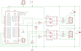{#fig:extension-board-schematic width=100%}

The schematic is designed such that the *receive* (*R*), *drive* (*D*) and *drive enable* (*DE*) pins of both transceiver chips *IC1* and *IC2* -- not just one direction for each chip -- are connected to the Raspberry Pi. Currently, only one direction for each chip is supported, but this design allows bidirectional use of the chips in the future (see [@sec:outlook]). The negated *receive enable* (*!RE*) pin is hard-wired to ground (*GND*) to enable receiving, as this cannot cause harm to data transmission.

Received data at the *R* pins are forwarded to the GPIO pins via voltage dividers (resistors *R3*/*R4* and *R5*/*R6*) to reduce the 5V output signal to the allowed 3.3V for Raspberry Pi's inputs. *IC2*'s received data (of the DMX input line) additionally to SPI's *MISO* (*Master In, Slave Out*) pin go also into UART's *RXD* (receive) pin as that was my first try to make receiving DMX data on the Raspberry Pi work. *IC1*'s received data (of the DMX output line) go into the *SDA* pin to keep the option open to use the $I^2C$ bus to parse data there; otherwise it can be used as a simple GPIO pin.

Resistors *R1* and *R2* are DMX termination resistors as defined in the [DMX standard](#sec:dmx-electrical). Both chips' supply voltage (*VCC*) pins are connected to ground via small capacitors (*C1* and *C2*) to mitigate voltage peaks of the power supply.

All other parts in the schematic are plug connectors; *JP1* and *JP2* go to the DMX XLR connectors, *JP3* and *JP4* allow an external voltage supply to power the Raspberry Pi through the extension board instead of the onboard micro USB port.

\glsadd[format=(]{eagle:extension-board.brd}This schematic was then transformed into a two-sided layout that can either be printed to create a *PCB* (printed circuit board) or soldered manually on a drilled board, which I did. The layout is shown in [@fig:extension-board-layout], the finished board in [@fig:extension-board-photos].\glsadd[format=)]{eagle:extension-board.sch}

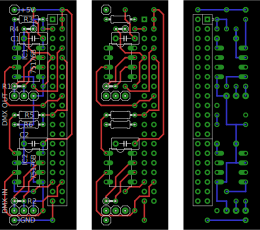{#fig:extension-board-layout width=75%}

\glsadd[format=)]{eagle:extension-board.brd}

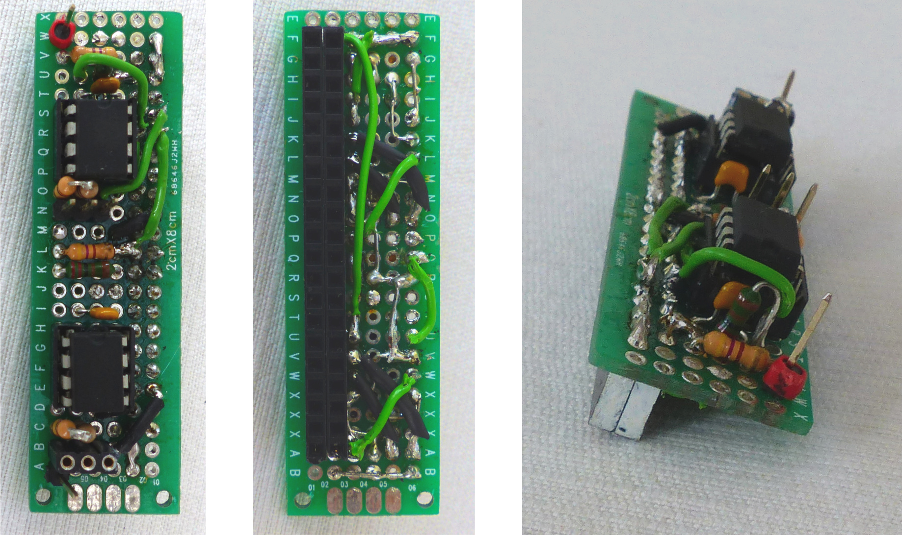{#fig:extension-board-photos width=100%}

After installing the extension board on Raspberry Pi's GPIO pins, fixtures connected via *IC1*'s DMX line can be controlled by changing an OLA universe's channel values in the web interface. The UART output port just has to be patched to that universe.

In an earlier version, termination resistors were missing, which resulted in an increased number of transmission errors. Also, both transceiver chips' *Drive enable* pin were hard-wired to *VCC*. Thus, whenever the receiver chip (*IC2*) was connected to a DMX line with another DMX source, it always tried to pull the bus to `low` and eventually broke down.


## Implementation of the DMXCreator 512 Basic protocol as OLA USB sub-plugin {#sec:ola-dmxcreator-plugin}

The second DMX output port shall be provided by the *DMXCreator 512 Basic* USB-to-DMX adapter[^dmxcreator512basic]. It is only officially supported by VXCO's Windows lighting software *DMXCreator* [@vxco-dmxcreator-manual]. To make it usable in OLA, its protocol must be reverse engineered and then re-implemented as an extension for the [USB DMX Plugin](#sec:ola-usb-plugin).

[^dmxcreator512basic]: <http://www.dmx512.ch/512.html>

### Reverse engineering the protocol with Wireshark

\glsadd[format=(]{dmxcreator.pcap}To capture the traffic between the DMXCreator software and USB adapter, I installed the network analyzer software *Wireshark* with USB support on Windows[^wireshark-usb] and went through the steps in [@tbl:dmxcreator-wireshark-procedure]. By investigating the resulting capture file \gls{dmxcreator.pcap}, I found out the following:

[^wireshark-usb]: Instructions: <https://wiki.wireshark.org/CaptureSetup/USB>

1. Only when the source DMX data changes (e.g. while fading a slider), USB traffic can be observed. The adapter generates a DMX signal with a valid refresh rate itself. This was verified by unplugging power of a connected fixture, which instantly reset to the correct color when it was plugged in again.
2. For every DMX data change, one packet with a constant byte string is sent to USB endpoint `0x01` of the device and then either one or two data packets (with 256 bytes of payload each) are sent to endpoint `0x02`:
    a) If the change occurs in the first half of the universe (channels 1 to 256), the byte string is `0x80 0x01 0x00 0x00 0x00 0x01` and only one data packet is sent.
    b) If the change occurs in the second half (channels 257 to 512), the byte string is `0x80 0x01 0x00 0x00 0x00 0x02` and two data packets are sent.
3. The data packets' payload consists of half a universe's DMX channel values as one byte string. Hence, two data packets are needed if the changed channel is located in the second half.
4. The USB device's vendor ID is `0x0a30`, its product ID is `0x0002` (included in packet 88; can also be retrieved by running `lsusb` on Linux).

Table: Procedure for capturing DMXCreator's USB communication protocol. The *pcap packets* column corresponds to the packets in \gls{dmxcreator.pcap} that were captured during each step. {#tbl:dmxcreator-wireshark-procedure}

--------------------------------------------------------------------------------
  # Step                                                                *pcap*
                                                                       packets
--- ---------------------------------------------------------------  -----------
 1. Start to capture USB traffic with Wireshark.                        0 -- 26

 2. Plug in the DMXCreator 512 Basic USB adapter.                      27 -- 97

 3. Start the DMXCreator software.                                     98 -- 103

 4. Patch *eurolite LED PAR-64 RGB Spot* fixture (5 channels: Red,
    Green, Blue, Dimmer, Flash) to DMX address 1.

 5. Patch another *eurolite LED PAR-64 RGB Spot* fixture to DMX
    address 367.

 6. Go to main window.                                                104 -- 106

 7. Slowly fade the first fixture's *Red* channel (DMX channel 1)
    down from 255 to 0.                                               107 -- 260

 8. Slowly fade the second fixture's *Blue* channel (DMX channel
    369) down from 255 to 86.                                         261 -- 386

 9. Slowly fade the second fixture's *Green* channel (DMX channel
    368) down from 255 to 0.                                          387 -- 224

10.  End capturing.
--------------------------------------------------------------------------------

\glsadd[format=)]{dmxcreator.pcap}

### Extending OLA's USB DMX Plugin

The reverse-engineered protocol now had to be incorporated into OLA's [USB DMX Plugin](#sec:ola-usb-plugin). Since this plugin does not depend on Raspberry Pi's embedded hardware, development could happen completely on my more powerful work computer to speed up build times.

*Note:* All code blocks in this section can be found unshortened in OLA's GitHub pull request 1136[^ola-github-pr-usbdmx].

[^ola-github-pr-usbdmx]: <https://github.com/OpenLightingProject/ola/pull/1136/files>

First, the user starting `olad` has to be given permissions to communicate with the USB adapter. This can be achieved by adding the following rule to the udev rules from [@sec:usb-configuration] in `/etc/udev/rules.d/10-ola.rules` and reloading the rules. It allows all members of the *plugdev* group access to USB devices identified by the given vendor and product IDs.

``` {style="myBash" .numberLines firstnumber=19}
# udev rules for the DMXCreator 512 Basic device
SUBSYSTEM=="usb|usb_device", ACTION=="add", ATTRS{idVendor}=="0a30", ATTRS{idProduct}=="0002", GROUP="plugdev"
```

I also added the rule to OLA's \gls{ola.udev} file to have it included in released OLA `.deb` packages. When installing these, the rules gets extracted to the correct location.

##### DMXCreator512BasicFactory (factory class)

\glsadd[format=(]{usbdmx:DMXCreator512BasicFactory.cpp}For creating a new sub-plugin of the USB DMX Plugin, I followed its developer information document[^ola-github-usbdmx-development]. Every sub-plugin has a *factory* class, whose `DeviceAdded` method is called whenever a new USB device is found. This method is expected to return `false` if the device should not or cannot be claimed by this sub-plugin. In *DMXCreator*'s case, the only identifying attributes of the USB adapter are its vendor and product IDs.

[^ola-github-usbdmx-development]: <https://github.com/OpenLightingProject/ola/blob/master/plugins/usbdmx/README.developer.md>

``` {style="myCpp" .numberLines firstnumber=36 caption="[Excerpt from \glsfont{DMXCreator512BasicFactory.cpp}]Excerpt from \gls{usbdmx:DMXCreator512BasicFactory.cpp}."}
const uint16_t DMXCreator512BasicFactory::VENDOR_ID = 0x0a30;
const uint16_t DMXCreator512BasicFactory::PRODUCT_ID = 0x0002;

bool DMXCreator512BasicFactory::DeviceAdded(
    WidgetObserver *observer,
    libusb_device *usb_device,
    const struct libusb_device_descriptor &descriptor) {
  if (descriptor.idVendor != VENDOR_ID || descriptor.idProduct != PRODUCT_ID) {
    return false;
  }

  LibUsbAdaptor::DeviceInformation info;
  if (!m_adaptor->GetDeviceInfo(usb_device, descriptor, &info)) {
    return false;
  }

  OLA_INFO << "Found a new DMXCreator 512 Basic device";
```

The USB adapter does not return a serial number, so because it is not possible to distinguish between different devices, only one at a time is supported.

``` {style="myCpp" .numberLines firstnumber=58}
  if (info.serial.empty()) {
    if (m_missing_serial_number) {
      OLA_WARN << "We can only support one device without a serial number.";
      return false;
    } else {
      m_missing_serial_number = true;
    }
  }
```

In the case that the device *should* be claimed, the method creates a new widget instance, passes it to `BaseWidgetFactory`'s `AddWidget` method (located in *WidgetFactory.h*), which tries to initialize it, and returns the result. OLA supports detecting *hot-plugged* devices (i.e. devices plugged in after OLA was started) in the default asynchronous mode of the underlying `libusb` library, but a fallback version using `libusb`'s synchronous methods shall be implemented as well. Thus, two classes `AsynchronousDMXCreator512Basic` and `SynchronousDMXCreator512Basic` are implemented as child classes of the widget class `DMXCreator512Basic`.\glsadd[format=)]{usbdmx:DMXCreator512BasicFactory.cpp}

##### DMXCreator512Basic (widget class)

\glsadd[format=(]{usbdmx:DMXCreator512Basic.cpp}The protocol allows sending a whole universe (instead of only the first half), thus I decided to always use this method. In \gls{usbdmx:DMXCreator512Basic.cpp}, I declared a constant array with the bytes which should be sent to USB endpoint `0x01`.

``` {style="myCpp" .numberLines firstnumber=55 caption="[Excerpt from \glsfont{DMXCreator512Basic.cpp}]Excerpt from \gls{usbdmx:DMXCreator512Basic.cpp}."}
// if we only wanted to send the first half of the universe, the last byte would
// be 0x01
static const uint8_t status_buffer[6] = {
  0x80, 0x01, 0x00, 0x00, 0x00, 0x02
};
```

Both the synchronous and asynchronous implementations of `DMXCreator512Basic` use the *Facade* software pattern, i.e. method calls to the widget class are passed through to a child class of `ThreadedUsbSender` or `AsyncUsbSender`, respectively. I explain my approach to implementing the synchronous version here because it is a bit easier to understand. The asynchronous version provides the same functionality while using asynchronous `libusb` methods and callback functions.

For initialization, the USB device must be opened and claimed. With the resulting device handle, the `ThreadedUsbSender` child class can be instantiated and a pointer of it is saved in the instance variable `m_sender`.

``` {style="myCpp" .numberLines firstnumber=160}
bool SynchronousDMXCreator512Basic::Init() {
  libusb_device_handle *usb_handle;

  bool ok = m_adaptor->OpenDeviceAndClaimInterface(
      m_usb_device, 0, &usb_handle);
  if (!ok) {
    return false;
  }

  std::auto_ptr<DMXCreator512BasicThreadedSender> sender(
      new DMXCreator512BasicThreadedSender(m_adaptor, m_usb_device,
                                           usb_handle));
  if (!sender->Start()) {
    return false;
  }
  m_sender.reset(sender.release());
  return true;
}
```

Whenever new DMX data shall be sent via this USB adapter, the widget's `SendDMX` method is called, which just forwards the `DmxBuffer` object to `m_sender` if it is already available (i.e. if the `Init` function was called correctly before), whose infinite loop then in turn calls `TransmitBuffer` in the next iteration.

``` {style="myCpp" .numberLines firstnumber=179}
bool SynchronousDMXCreator512Basic::SendDMX(const DmxBuffer &buffer) {
  return m_sender.get() ? m_sender->SendDMX(buffer) : false;
}
```

In `TransmitBuffer`, the provided `DmxBuffer` first is compared with the last transmitted one. If they are the same, nothing needs to be transmitted at all.

``` {style="myCpp" .numberLines firstnumber=96}
bool DMXCreator512BasicThreadedSender::TransmitBuffer(
    libusb_device_handle *handle, const DmxBuffer &buffer) {

  if (m_dmx_buffer == buffer) {
    // no need to update -> sleep 50µs to avoid timeout errors
    usleep(50);
    return true;
  }

  m_dmx_buffer = buffer;
```

Else, both halves of the universe are copied into `m_universe_lower` and `m_universe_upper`. If the provided `DmxBuffer` does not contain all 512 channels (the `length` variable gets set to the number of copied channels), the rest is filled up with zeros.

``` {style="myCpp" .numberLines firstnumber=107}
  unsigned int length = CHANNELS_PER_PACKET;
  m_dmx_buffer.Get(m_universe_data_lower, &length);
  memset(m_universe_data_lower + length, 0, CHANNELS_PER_PACKET - length);

  length = CHANNELS_PER_PACKET;
  m_dmx_buffer.GetRange(CHANNELS_PER_PACKET, m_universe_data_upper, &length);
  memset(m_universe_data_upper + length, 0, CHANNELS_PER_PACKET - length);
```

Afterwards, `status_buffer` is sent to USB endpoint `0x01` and both halves are consecutively sent to endpoint `0x02`. If any operation fails, `false` is returned, so that the thread stops and the device handle gets closed.

``` {style="myCpp" .numberLines firstnumber=115}
  bool r = BulkTransferPart(handle, ENDPOINT_1, status_buffer,
                            sizeof(status_buffer), "status");
  if (!r) {
    return false;
  }

  r = BulkTransferPart(handle, ENDPOINT_2, m_universe_data_lower,
                       CHANNELS_PER_PACKET, "lower data");
  if (!r) {
    return false;
  }

  r = BulkTransferPart(handle, ENDPOINT_2, m_universe_data_upper,
                       CHANNELS_PER_PACKET, "upper data");
  return r;
}
```

&nbsp;\glsadd[format=)]{usbdmx:DMXCreator512Basic.cpp}

##### Integration

At several locations, the new classes had to be integrated into the USB DMX Plugin. However, the required snippets are very similar to all existing sub-plugins, hence, I will not include them here, but only provide a list of changed files and functions for reference:

* \gls{usbdmx:AsyncPluginImpl.cpp}:  
  instantiated factory class in `Start` method; overloaded `NewWidget` method
* \gls{usbdmx:AsyncPluginImpl.h}:  
  overloaded `NewWidget` method
* \gls{usbdmx:SyncPluginImpl.cpp}:  
  instantiated factory class in constructor; overloaded `NewWidget` method
* \gls{usbdmx:SyncPluginImpl.h}:  
  overloaded `NewWidget` method
* \gls{usbdmx:SyncronizedWidgetObserver.h} [sic][^ola-usbdmx-synchronized-issue]:  
  overloaded `NewWidget` method
* \gls{usbdmx:WidgetFactory.h}:  
  overloaded virtual `NewWidget` method

[^ola-usbdmx-synchronized-issue]: I raised issue [#1331](https://github.com/OpenLightingProject/ola/issues/1331) on GitHub to correct the typing error.

Additionally, the USB adapter was included in \gls{usbdmx:UsbDmxPlugin.cpp}'s plugin description[^ola-plugin-desc-location] and the new files had to be added to \gls{usbdmx:Makefile.mk} to allow recompiling with `make` and `make install`.

[^ola-plugin-desc-location]: Today, after changes in OLA's plugin structure, the plugin description is located in *README.md* and read\ in from there.

Now, patching the new *DMXCreator 512 Basic USB Device* to a universe in OLA's web interface and sending DMX data through it is working as expected.

The new code was merged back into OLA's project repository on GitHub[^ola-github-usbdmx-pr], after improving my initial version together with the project's main developers Peter Newman and Simon Newton.

[^ola-github-usbdmx-pr]: <https://github.com/OpenLightingProject/ola/pull/1136>


## Implementation of the OLA Native SPI DMX Plugin {#sec:ola-spidmx-plugin}

Two output ports are provided by the UART and USB DMX plugins, the input port is yet to be implemented. In this section I briefly describe my first two approaches and why they failed. Afterwards, the working solution with SPI is explained in detail.

### Insufficiency of Raspberry Pi's UART input {#sec:uart-insufficiency}

My first idea was to extend the UART plugin to also support DMX input. This seemed perfect since the UART and DMX protocols are so similar and very little software overhead would be needed.

However, there is a big catch: Receiving and recognizing the BREAK signal is very difficult because it is just forwarded to the application as a null byte and thus indistinguishable from data channels that are just set to zero. There are options in the `termios` C interface's `c_iflag` input flags to change this:

``` {morekeywords="BRKINT, IGNBRK, PARMRK, INPCK, IGNPAR, ISTRIP" caption="[Excerpt from the \emph{termios} man page]Excerpt from the \emph{termios} man page. Note that octal {\textbackslash}377 is 255 in decimal."}
BRKINT If IGNBRK is set, a BREAK is ignored.  If it is not set but
       BRKINT is set, then a BREAK causes the input and output queues
       to be flushed, and if the terminal is the controlling terminal
       of a foreground process group, it will cause a SIGINT to be
       sent to this foreground process group.  When neither IGNBRK
       nor BRKINT are set, a BREAK reads as a null byte ('\0'),
       except when PARMRK is set, in which case it reads as the
       sequence \377 \0 \0.

IGNPAR Ignore framing errors and parity errors.

PARMRK If this bit is set, input bytes with parity or framing errors
       are marked when passed to the program.  This bit is meaningful
       only when INPCK is set and IGNPAR is not set.  The way erro-
       neous bytes are marked is with two preceding bytes, \377 and
       \0.  Thus, the program actually reads three bytes for one
       erroneous byte received from the terminal.  If a valid byte
       has the value \377, and ISTRIP (see below) is not set, the
       program might confuse it with the prefix that marks a parity
       error.  Therefore, a valid byte \377 is passed to the program
       as two bytes, \377 \377, in this case.

       If neither IGNPAR nor PARMRK is set, read a character with a
       parity error or framing error as \0.

INPCK  Enable input parity checking.

ISTRIP Strip off eighth bit.
```

However, regardless of which settings I tried, after some time only random data bytes were decoded. The UART seemed to be confused by the frequent BREAKs.

I was unable to figure out where this issue arose from because I could not verify if the signal was captured by the UART correctly. So I decided to look for a way to receive data that permits access to the "raw" DMX signal, as this would potentially be a more stable approach. It would require implementing parsing myself but thereby also give me full control over it.

<!--
Clearing `BRKINT` and `IGNBRK` and setting `PARMRK` doesn't help either because then two

After trying out different combinations, I figured out that there had to be an additional problem.

In the Broadcom BCM2835 (Raspberry Pi's processor) manual [@broadcom-bcm2835], both its UART port are described: *UART0* (*PL011 UART*) and *UART1* (*Mini UART*).


The Raspberry Pi documentation [@raspberrypi-uart] explains that there are two

* <http://man7.org/linux/man-pages/man3/tcsetattr.3.html>
* <http://www.unix.com/programming/42767-cannot-catch-sigint-while-serial-break-condition-occurs-2.html>
* <https://linux.die.net/man/4/tty_ioctl>
* <http://web.archive.org/web/20130407235619/http://www.easysw.com/~mike/serial/serial.html#5_1_1>
* <https://github.com/OpenLightingProject/ola/pull/1142/commits/2a51b743446f2209f0cff13675c48c3c92aad706>
* <https://github.com/OpenLightingProject/ola/issues/1183>
* <https://www.raspberrypi.org/documentation/configuration/uart.md>
-->

### Bit bang reading with pigpio library

The next idea was to constantly poll one GPIO pin's value and getting the raw signal that way. This technique is known as "bit bang reading" in the *pigpio* library[^pigpio]. I had concerns about the speed and precision of the read process, since Linux is not a real time operating system and scheduling could delay read operations so that they already sample the pin when the next bit is fed in. At 250kbit/s, these delays could already be significant.

Fortunately, *pigpio* provides a diagnose tool called *piscope* that displays the bit banged signal. I generated DMX data with an external DMX interface and inspected the signal captured by *piscope*. An example capture image together with the expected signal can be seen in [@fig:piscope-vs-spi].

{#fig:piscope-vs-spi width=100%}

This revealed that often a short pulse, i.e. a quick change from `low` to `high` to `low` or the other way around, was not visible at all, e.g. in slot 4 and 7 in [@fig:piscope-vs-spi]. Additionally, sampling seemed to happen once every 5µs, since slots' stop bits (2 `high` bits) lasted sometimes 5µs and sometimes 10µs, but never 8µs as expected.

In conclusion, "bit bang reading" a GPIO pin is not sufficiently accurate for the 250kbit/s DMX signal.

[^pigpio]: <http://abyz.me.uk/rpi/pigpio/cif.html#gpioSerialReadOpen>

### Using SPI to sample DMX

An idea I came across in a *Raspberry Pi StackExchange* answer[^stack-exchange-spi] while researching GPIO bit banging speeds was sampling the native SPI port (see [@sec:spi]) for arbitrary DMX data. For this, the DMX line is connected (via the bus transceiver) to Raspberry Pi's *MISO* (*Master In, Slave Out*) pin, the other SPI pins are left unconnected. The intention is that SPI is designed for much higher speeds than UART, so a stable clock frequency is important. Unfortunately, not many details were provided in that post, and it seems to be a very uncommon technique, so I had to figure out most steps myself.

[^stack-exchange-spi]: <https://raspberrypi.stackexchange.com/a/2044>

Raspberry Pi's SPI controller (acting as SPI master) has a core frequency of 250MHz that can be divided by any even number[^spi-freq]. The goal is to sample the connected DMX signal 8 times per bit to have enough tolerance if sometimes the sample time falls exactly on an edge, so the required sample frequency is 250kbit/s · 8/bit = 2MHz. The required clock divider 250MHz / 2MHz = 125 is odd, so 124 will be used instead (odd divisors are rounded down) and parsing of the sampled bits must be flexible enough to account for this inaccuracy. However, since a valid DMX receiver has to accept any signal with a bit rate of 245kbit/s to 255kbit/s (see [@sec:dmx-protocol]), flexibility must be ensured anyway.

[^spi-freq]: According to the BCM2835 manual [@broadcom-bcm2835], only powers of two can be used as clock divider, but this is incorrect according to <https://raspberrypi.stackexchange.com/a/3444> and testing by myself.

\begin{align*}
f_{eff} = \frac{250\text{MHz}}{124} &\approx 2.02\text{MHz}\\[3pt]
\frac{f_{eff}}{245\text{kbit/s}} &\approx \frac{8.23\text{ sampled bits}}{\text{DMX bit}}\\[3pt]
\frac{f_{eff}}{250\text{kbit/s}} &\approx \frac{8.06\text{ sampled bits}}{\text{DMX bit}}\\[3pt]
\frac{f_{eff}}{255\text{kbit/s}} &\approx \frac{7.91\text{ sampled bits}}{\text{DMX bit}}
\end{align*}

#### Enabling SPI

Enabling SPI can be done with `raspi-config`. To increase the buffer size (i.e. the number of bytes that can be received/transmitted in one operation), `spidev.bufsiz=65536` should be added to the kernel options in `/boot/cmdline.txt`. After a reboot, the value returned by `cat /sys/module/spidev/parameters/bufsiz` should be the requested 65536.

*Note:* Since there is much contradicting information available online, I want to clarify: In newer firmware versions, no additional steps (like manually enabling a kernel module or blacklisting another) are needed.

To test the configuration, the *MISO* and *MOSI* pins can be wired together for a *loopback* test:

```{style="myBash" morekeywords="wget, gcc"}
wget https://raw.githubusercontent.com/raspberrypi/linux/rpi-3.10.y/Documentation/spi/spidev_test.c
gcc -o spidev_test spidev_test.c
./spidev_test --device /dev/spidev0.0 --speed 2000000
```

Output should look like the following.

```
spi mode: 0
bits per word: 8
max speed: 2000000 Hz (2000 KHz)

FF FF FF FF FF FF
40 00 00 00 00 95
FF FF FF FF FF FF
FF FF FF FF FF FF
FF FF FF FF FF FF
DE AD BE EF BA AD
F0 0D
```

Additionally, I ran the test while connecting the *MISO* pin to either +3.3V, ground, or leaving it unconnected. As expected, the output was `FF`s only, `00`s only and again `00`s only, respectively.

#### Receiving DMX data

\glsadd[format=(]{spi-receive.c}Based on the loopback test program above, I wrote \gls{spi-receive.c}, which reads in 8192 bytes[^spi-8192-bytes] four times from the SPI MISO bus and outputs them in binary format to the console. As the loopback test code and the existing SPI Plugin (see [@sec:ola-spi-plugin]) do too, it uses the `spidev` interface, which enables SPI communication from user space (not as part of the kernel).

[^spi-8192-bytes]: On Raspberry Pi, *spidev*'s buffer size is 4096 bytes by default. Because this limit is too low (see end of [@sec:spidmx-wrapping]), its maximum size was increased to 65536 in the previous section.

A single SPI transfer with `spidev` is configured by an `spi_ioc_transfer` struct like shown below. The transfer itself is then executed with `ioctl(fd, SPI_IOC_MESSAGE(1), &tr)`.

``` {#lst:spi-receive style="myCpp" .numberLines firstnumber=43 caption="[Excerpt from \glsfont{spi-receive.c}]Excerpt from \gls{spi-receive.c}."}
  struct spi_ioc_transfer tr = {
    // don't transmit anything
    .tx_buf = 0,

    // save received bytes into `rx` buffer (at appropriate offset)
    .rx_buf = (unsigned long)(rx + BYTES_PER_TRANSFER*offset),

    // bytes to send/receive in this transfer operation
    .len = BYTES_PER_TRANSFER,

    // don't delay after data bytes are sent
    .delay_usecs = delay,

    // overwrite speed temporarily to 2MHz
    .speed_hz = speed,

    // overwrite bits per word temporarily to 8
    .bits_per_word = bits_per_word,
  };
```

The `transfer` function, where the struct above is created and used to initiate the SPI data transfer, is called four times. Afterwards, the `printBinary` function prints the `rx` buffer as binary numbers. It uses the `BYTE_TO_BINARY` macro to deconstruct bytes into 8 ones and zeros.

``` {style="myCpp" .numberLines firstnumber=71}
#define BYTE_TO_BINARY_PATTERN "%c %c %c %c %c %c %c %c "
#define BYTE_TO_BINARY(byte)  \
  (byte & 0x80 ? '1' : '0'), \
  (byte & 0x40 ? '1' : '0'), \
  (byte & 0x20 ? '1' : '0'), \
  (byte & 0x10 ? '1' : '0'), \
  (byte & 0x08 ? '1' : '0'), \
  (byte & 0x04 ? '1' : '0'), \
  (byte & 0x02 ? '1' : '0'), \
  (byte & 0x01 ? '1' : '0')
```

\glsadd[format=)]{spi-receive.c}\glsadd[format=(]{dmx-spi-data.txt}I tried the program with an example DMX signal and saved the resulting binary data to \gls{dmx-spi-data.txt}. Then these data were loaded and plotted in *GNU Octave*[^gnu-octave] with the following commands. A screenshot of the resulting plot is shown in [@fig:octave-spi].

[^gnu-octave]: <https://www.gnu.org/software/octave/>

``` {style="myBash" morekeywords="load, stairs, axis"}
load "dmx-spi-data.txt"
data2 = dmx_spi_data(2, :)  # copy 2nd chunk
stairs(data2 * 0.9 + 0.05)  # show square signal
axis([17000 19500 0 1])     # show x values (bits) 17000...19500, y values 0...1
```

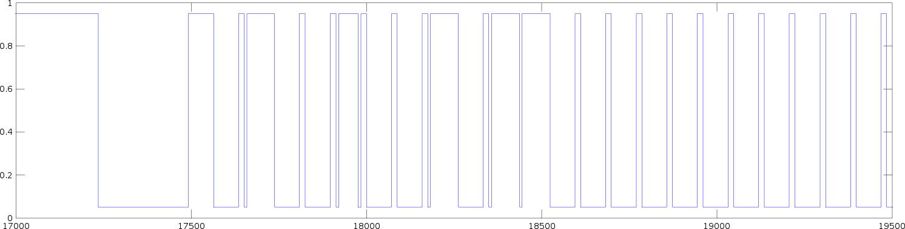{#fig:octave-spi width=100%}

I repeated the procedure multiple times and the plots kept looking very promising. No short pulses were missed and due to the oversampling, the timing was also very accurate[^piscope-actual-data]. The only problem I noticed was that two consecutive chunks (i.e. received in multiple transfer operations) are separated by an uncaptured gap, even if the `transfer` calls are right after each other in the code.

[^piscope-actual-data]: Actually, the "real" DMX signal that the *piscope* bit banged signal in [@fig:piscope-vs-spi] was compared against, was a plot of the same data received with SPI.

That means that the resulting bytes cannot be parsed as a (possibly infinitely) long stream of bits, but rather each chunk must be parsed on its own. As a result, there are chunks that do only contain the start of a DMX packet, some do only contain the end. These are useless though, since it is not clear how many channels have been transmitted before. Thus, the refresh rate is lower for higher channels. The problem is visualized in [@fig:spi-dmx-chunks].\glsadd[format=)]{dmx-spi-data.txt}

![Received SPI chunks versus DMX signal stream. *(Note: Sizes and proportions are not to scale.)* DMX packets can be either fully enclosed in one SPI chunk (case 1; this is the optimum case) or only partially. If only the end of a DMX packet is contained (case 2), the chunk is useless. If a DMX packet's start is included (case 1 and case 3), all channel values until the chunk end can be correlated to their respective channel numbers. Since it is less likely that a DMX packet starts right at the chunk's beginning than somewhere in the middle, higher channels are updated less often.](Bilder/spi-dmx-chunks.svg){#fig:spi-dmx-chunks width=100%}

#### Parsing received SPI chunks

As mentioned earlier, receiving the raw signal requires implementing parsing the DMX channel values from the sampled data myself. This parsing has to obey timing constraints of the [DMX protocol](#sec:dmx-protocol).

My approach to implementing this is a state machine that processes the sampled data bit by bit, proceeds to the next state if the received data follow the DMX protocol and goes back to the initial state otherwise. A flow chart of this state machine is pictured in [@fig:spi-dmx-state-machine].

After a DMX slot's start bit is detected, always the middle of the following 8 DMX bits (= 8 "SPI bytes") is sampled to construct the channel value. The subsequent stop bits decide how to proceed:

a) Either the two stop bits are `high` and arbitrarily many `high` bits as *mark between slots* / *mark before BREAK* follow. Then, at the next falling edge, the parser saves the constructed DMX channel value to the correct position and continues in the *in data start bit* state for the next slot. An exception is the last channel: If the just saved DMX value was written to channel 512, then it is clear that no more slots can follow, so the DMX packet is completed and the state gets changed to *in BREAK* instead.
b) Or there are `low` bits where the stop bits should be. If the constructed channel value is also zero, that was actually not a data slot, but the beginning of the BREAK. So all channel values from here on are set to zero, the DMX packet is completed and the state machine proceeds to *in BREAK*.

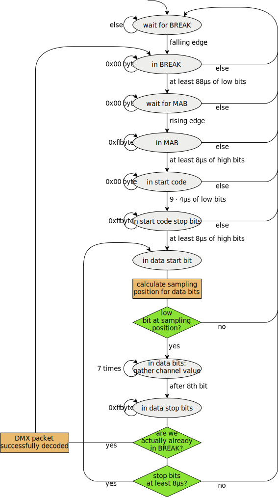{#fig:spi-dmx-state-machine width=79%}

\glsadd[format=(]{spidmx:SPIDMXParser.cpp}To recognize falling and rising edges, I wrote two helper functions. `DetectFallingEdge` returns the number of zeros if the passed byte has the form $1^n 0^{8-n}$ ($n \in \{ 0, …, 7 \}$), and -1 otherwise. Note that this case can occur if the byte contains either only ones or random spikes. `DetectRisingEdge` works equivalently.

I show the `WaitForMab` function as a simple state handler example. It looks for the first rising edge after the BREAK to change to the `IN_MAB` state.

``` {style="myCpp" .numberLines firstnumber=259 caption="[Excerpt from \glsfont{SPIDMXParser.cpp}]Excerpt from \gls{spidmx:SPIDMXParser.cpp}."}
void SPIDMXParser::WaitForMab() {
  uint8_t byte = chunk[chunk_bitcount];
  if (byte != 0) {
    int8_t ones = DetectRisingEdge(byte);
    if (ones > 0) {
      ChangeState(IN_MAB);
      state_bitcount = ones;
    } else {
      ChangeState(WAIT_FOR_BREAK);
    }
  }
  chunk_bitcount++;
}
```

Another notable state handler is `InDataStartbit` because it calculates the sampling position of the DMX data bits. This sampling position should always be in the middle of a byte, and thus depends on `state_bitcount`, i.e. the number of "SPI bits" that belong to the current state, set by the previous state handler (i.e. `InStartcodeStopbits` or `InDataStopbits`). Possibly, the middle bit was already contained in the last handled byte, so the current byte is reset to the previous one in this case. [@Tbl:calc-sampling-pos] lists all possible cases.

``` {style="myCpp" .numberLines firstnumber=385}
void SPIDMXParser::InDataStartbit() {
  uint8_t byte = chunk[chunk_bitcount];

  if (state_bitcount >= 4) {
    // look at the last byte again and don't increase chunk_bitcount
    byte = chunk[chunk_bitcount - 1];
    sampling_position = state_bitcount - 4;
  } else {
    // next byte will be handled in next step as usual
    chunk_bitcount++;
    sampling_position = state_bitcount + 8 - 4;
  }

  // start bit must be zero
  if ((byte & (1 << sampling_position))) {
    ChangeState(WAIT_FOR_BREAK);
  } else {
    current_dmx_value = 0x00;
    ChangeState(IN_DATA_BITS);
  }
}
```

Table: Calculating the sampling position in `InDataStartbit` state handler. `d` represents a data bit. The desired sampling position is indicated with an arrow. {#tbl:calc-sampling-pos}

--------------------------------------------------------------------------------
 state       previous byte,↩      backtrack?    new current sampling bit
bit count     current byte                          byte       number
---------  -------------------   ------------   ----------- ------------
8          `00000000 dddddddd`    yes            `00000000`      4
           `___↑_____________`                   `___↑____`

7          `10000000 0ddddddd`    yes            `10000000`      3
           `____↑____________`                   `____↑___`

6          `11000000 00dddddd`    yes            `11000000`      2
           `_____↑___________`                   `_____↑__`

5          `11100000 000ddddd`    yes            `11100000`      1
           `______↑__________`                   `______↑_`

4          `11110000 0000dddd`    yes            `11110000`      0
           `_______↑_________`                   `_______↑`

3          `11111000 00000ddd`    no             `00000ddd`      7
           `_________↑_______`                   `↑_______`

2          `11111100 000000dd`    no             `000000dd`      6
           `__________↑______`                   `_↑______`

1          `11111110 0000000d`    no             `0000000d`      5
           `___________↑_____`                   `__↑_____`
--------------------------------------------------------------------------------

All other state handler functions can be inspected in \gls{spidmx:SPIDMXParser.cpp}.

The `ParseDmx` method, which is given an SPI chunk to parse, iterates through the chunk's bytes and calls the respective state handlers. Whenever a DMX packet end is detected, `PacketComplete` is called, which in turn invokes a callback function if it has been set before via \gls{spidmx:SPIDMXParser.h}'s `SetCallback` method.

*Note:* The code listings above are part of the OLA plugin I wrote. Details are outlined in the next section. Initially, I tested the code in a standalone version that could process the output of \gls{spi-receive.c}'s `printCArray` function.\glsadd[format=)]{spidmx:SPIDMXParser.cpp}

#### Wrapping the code into an OLA plugin {#sec:spidmx-wrapping}

The final step was to create a new OLA plugin that provides an input port for every SPI port found on the system. This port can then be patched to an OLA universe which is forwarded via Art-Net to the lighting software or directly to a DMX output port.

OLA's *OSC (Open Sound Control) Plugin* includes information about its development process[^ola-github-osc-readme] which is a good reference for writing a new plugin. As a name, I chose *Native SPI DMX Plugin*, following *Native UART DMX Plugin*'s convention. All classes are prefixed with `SPIDMX`; their namespace, as well as directory name, is `spidmx`. I based the general plugin structure on UART plugin's:

[^ola-github-osc-readme]: <https://github.com/OpenLightingProject/ola/blob/master/plugins/osc/README.developer.md>

* The *Plugin* class (\gls{spidmx:SPIDMXPlugin.h}) hooks into OLA's plugin infrastructure and searches for SPI devices.
* For every found SPI device, a new OLA *Device* (\gls{spidmx:SPIDMXDevice.h}) is instantiated, which in turn creates one instance of each of the following classes:
    - A *Widget* class (\gls{spidmx:SPIDMXWidget.h}) that abstracts away the required *spidev* calls.
    - A *Thread* class (\gls{spidmx:SPIDMXThread.h}) that repeatedly calls the Widget's `ReadWrite` method and saves the resulting data. The Thread itself instantiates a new *Parser* (\gls{spidmx:SPIDMXParser.h}) to decode the raw SPI data.
    - An *InputPort* class (\gls{spidmx:SPIDMXPort.h}) connects the Thread to OLA's plugin mechanism by forwarding DMX data and notifying the Thread whenever it is patched or unpatched to / from a universe.
* A \gls{spidmx:README.md} document describes the plugin.

The UML class diagram in [@fig:spidmx-class-diagram] clarifies those relations.

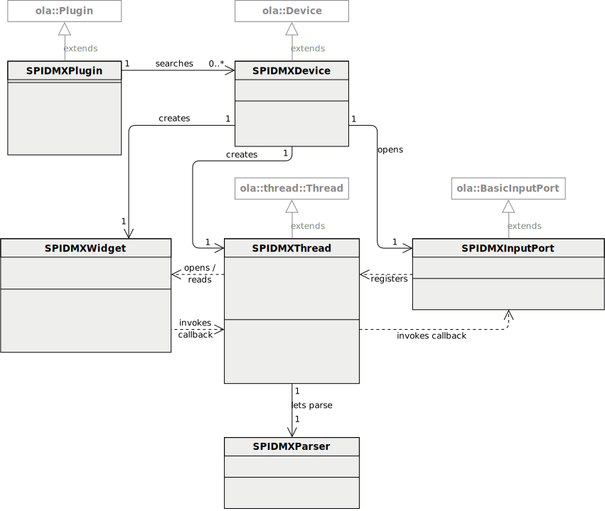{#fig:spidmx-class-diagram width=100%}

\glsadd[format=(]{spidmx:SPIDMXPort.h}Whenever the Parser detects a DMX packet end, its `PacketComplete` function invokes the callback function that was set in the constructor, called from \gls{spidmx:SPIDMXThread.cpp}. Its callback in turn is set in \gls{spidmx:SPIDMXPort.h}'s `PreSetUniverse` method ([@lst:spidmx-port]) which is always called when the universe that the port is patched to changes.

This callback chain needs special attention because one has to remember which pointers could still reference a callback variable, especially as it could be one in another thread. Mistakes here easily lead to segmentation faults.

``` {#lst:spidmx-port style="myCpp" .numberLines firstnumber=54 caption="[Excerpt from \glsfont{SPIDMXPort.h}]Excerpt from \gls{spidmx:SPIDMXPort.h}."}
  bool PreSetUniverse(Universe *old_universe, Universe *new_universe) {
    if (!old_universe && new_universe) {
      return m_thread->SetReceiveCallback(NewCallback(
        static_cast<BasicInputPort*>(this),
        &BasicInputPort::DmxChanged));
    }
    if (old_universe && !new_universe) {
      return m_thread->SetReceiveCallback(NULL);
    }
    return true;
  }
```

\glsadd[format=)]{spidmx:SPIDMXPort.h}\glsadd[format=(]{configure.ac}Since plugins can be enabled / disabled at build time, the *autotools* toolchain must be informed about the new plugin and its operating system dependencies (namely *spidev*), which was done by adding a single line to \gls{configure.ac}:

``` {.numberLines firstnumber=836 morekeywords="$have_spi"}
PLUGIN_SUPPORT(spidmx, USE_SPIDMX, [$have_spi])
```

\glsadd[format=)]{configure.ac}\glsadd[format=(]{olad:DynamicPluginLoader.cpp}Additionally, the plugin's \gls{spidmx:Makefile.mk}, which is similar to other plugins' Makefiles, had to be included from \gls{plugins:Makefile.mk}.

At runtime, the plugin is loaded in \gls{olad:DynamicPluginLoader.cpp}, where the build constant `USE_SPIDMX` determines if the plugin was enabled at build time.

``` {style="myCpp" .numberLines firstnumber=215}
#ifdef USE_SPIDMX
  m_plugins.push_back(
      new ola::plugin::spidmx::SPIDMXPlugin(m_plugin_adaptor));
#endif  // USE_SPIDMX
```

\glsadd[format=)]{olad:DynamicPluginLoader.cpp}Each plugin is assigned a plugin ID constant in \gls{Ola.proto}, in this case `OLA_PLUGIN_SPIDMX = 23`. It was temporarily 10000 during development and changed to its final value shortly before merging into the `master` branch.

After integrating the new plugin into the existing infrastructure, a complete rebuild of the project was required:

``` {style="myBash"}
autoreconf
./configure
make
sudo make install
sudo ldconfig
```

The finished SPI DMX Plugin was tested with multiple DMX sources and works fine. As explained earlier, higher channels are updated less often, resulting in higher latency. Hence, they should not be used for light fading, which should be smooth by definition.

The chunk size of one transmission -- which has the largest impact on this -- is configurable through OLA's plugin settings file (`/home/pi/.ola/ola-spidmx.conf`). However, the value of 8192 bytes seems to be a good compromise between a high probability of including higher channels in a chunk on one hand, and not having too large uncaptured gaps between chunks on the other.

*Note:* All code changes and additions from this section can be found in OLA's GitHub pull request 1289[^ola-github-pr-spidmx].

[^ola-github-pr-spidmx]: <https://github.com/OpenLightingProject/ola/pull/1289/files>


## Chassis build {#sec:chassis}

To make the DMX interface robust and portable, I housed the Raspberry Pi together with the [extension board](#sec:extension-board) in a plastic chassis.

{width=100%}

All external plugs (2 female XLR connectors, 1 male XLR connector, 1 Ethernet jack and 1 power supply plug) are connected via pluggable extension wires. This allows for a modular installation and easy replacement of faulty parts. To fit the *DMXCreator 512 Basic* USB adapter into the chassis, I had to remove its casing, replace its cable with a more flexible one and enclose it in a heat shrink tube.

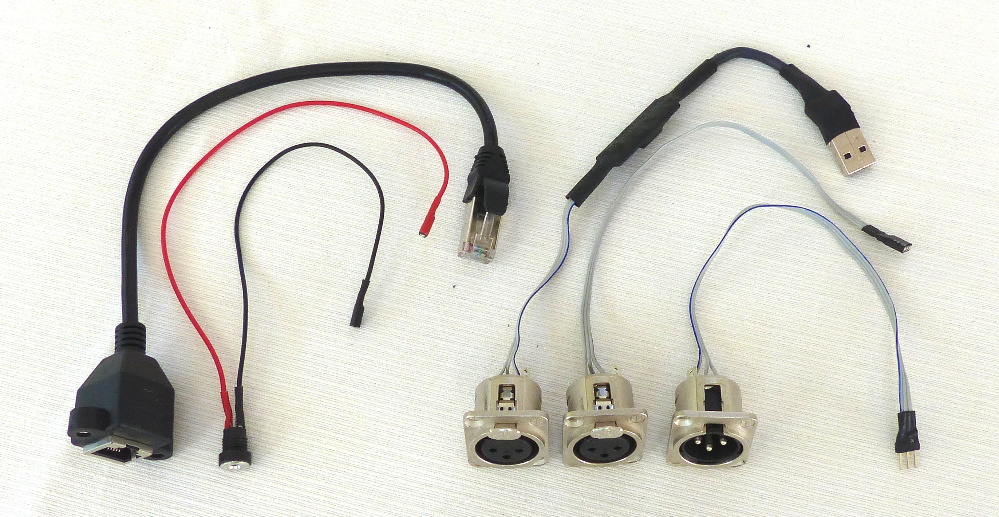{width=100%}

Because Raspberry Pi's indicator LEDs are useful to know if it has powered up and booted correctly, I mounted transparent plastic cords that act as optical waveguides.

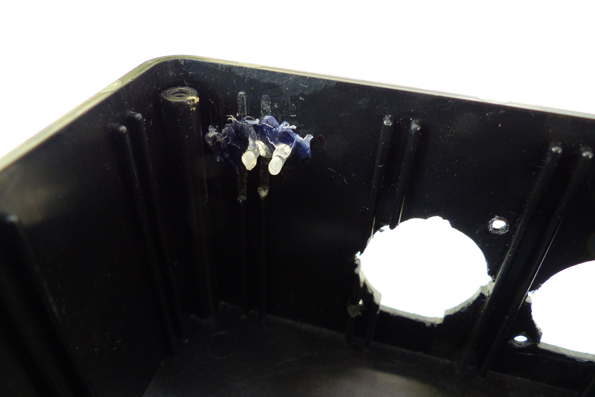{width=75%}

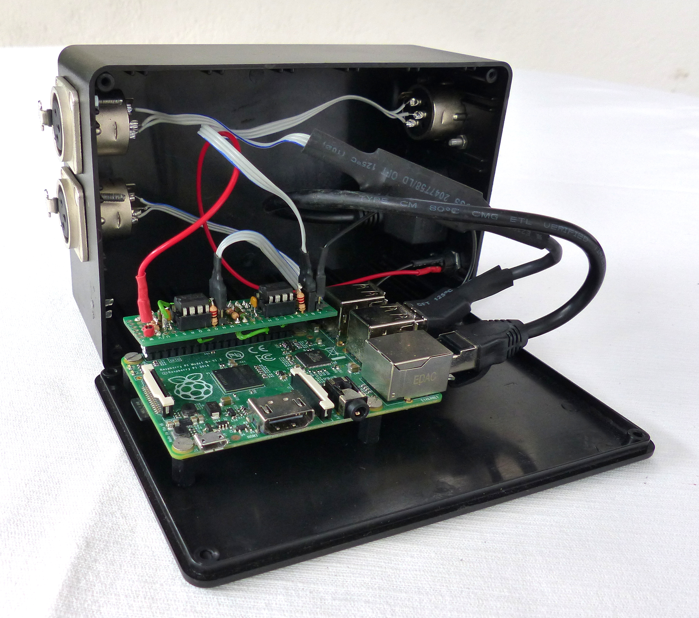{width=75%}

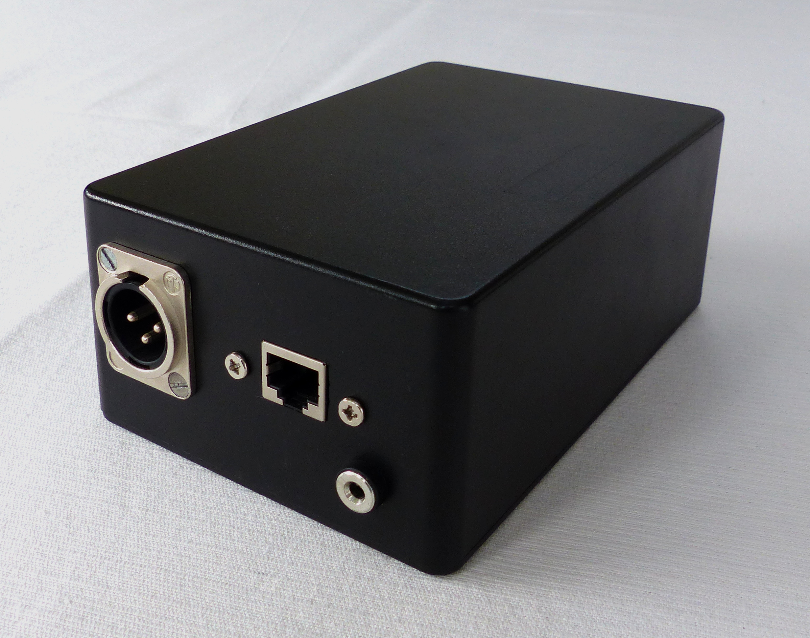{width=75%}


# Validation {#sec:testing}

The PC-DMX interface [implementation](#sec:implementation) -- both hardware and software -- needs to work reliably. This means in particular that it should fulfill all requirements I defined in [@sec:requirements] at all times, except when outer circumstances, e.g. power loss, prevent it from doing so.

Code quality checks and unit tests can help as automatic tools to ensure this. However, as I will outline in the first subsection, I cannot fully rely on them.

## Unit tests

The Open Lighting Architecture project provides a test infrastructure and various existing tests. My code changes and additions did not cause these existing tests to fail, which suggests that no regressions were introduced.

Testing the new code with actual hardware support is very difficult. A DMX signal would have had to be sent through an output port back into an input port to check its delay and data integrity. That procedure would depend on two plugins and thereby violate the principle of isolation for unit tests: If the test fails, it is not clear which of the components caused it to. Also, hardware testing is not automatable in continuous integration tools.

Instead, I manually tested the PC-DMX interface's functionality by connecting light fixtures and comparing expected and observed light output. Indeed, the interface was already successfully deployed at several events that lasted for around 10 hours. It ran stable for the whole period of time, indicating that no mistakes were made in the implementation that would noticeably affect the behavior.

## Code quality

To ensure a high code quality standard, the OLA project has defined a code style that has to be adhered to. The automatic *lint checks* that are run after every commit in GitHub pull requests to prevent violation are fulfilled by my code changes.

The consistent code style improves readability, which makes careful reviews by the project maintainers in the GitHub pull requests easier. Discussion there also helped find bugs and inconsistencies before merging the new features into the `master` branch.

## Fulfillment of requirements {#sec:fulfillment-requirements}

Many of the requirements are already fulfilled by OLA as the software basis. That applies to supporting different lighting control programs using both proprietary and open network protocols, ease of use through the web interface and being open-source. Also, OLA directly allows flexibly patching DMX inputs and outputs to universes, which permits all wanted use cases and possibly even more.

Two DMX outputs and one DMX input are supported right now, more can be added by simply connecting appropriate hardware via USB. DMX output frequency is satisfactory, which was verified manually by connecting light fixtures at different DMX addresses and fading them smoothly using a lighting control software. DMX input is also picked up often enough to allow smooth fading for approximately the lower 400 channels, fading higher channels feels rough.

The costs of Raspberry Pi 1 Model B+, 4GB microSD card, circuit board, electronic components, plug connectors chassis and power supply add up to about 60€, staying far below the limit of 100€. The *DMXCreator 512 Basic* USB adapter though is not included. It was apparently sold for over 400€[^vxco-pricing] before it was discontinued, but it was available to me for free anyway, so it would not be fair to count it. As substitute, other very cheap USB-DMX adapters (around 20€) could possibly be integrated into OLA with some effort. Other options are mentioned in the next chapter.

[^vxco-pricing]: <http://vxco.ch/wp-content/uploads/2012/10/DMXCREATOR-_PREISLISTE_CH_D_2.15.pdf>

Table: arraystretch=1.6 Fulfillment of requirements. See [@sec:requirements]. {#tbl:fulfillment-requirements}

--------------------------------------------------------------------------------
Requirement                                   Fulfillment
--------------------------------------------- ----------------------------------
Works with multiple lighting control programs :oksw:

Connection to computer possible via Ethernet  :oksw:

Open protocol between computer and interface  :oksw:
supported

2 DMX output ports                            :oksw:

1 DMX input port                              :oksw:

Input universe handling configurable          :oksw:

High refresh rate for DMX input and output    mostly :oksw:↩
                                              (higher DMX input channels are
                                              refreshed less often, see above)

Easy usability for end-users                  mostly :oksw:↩
                                              (computer's network settings
                                              have to be changed)

Costs below 100€                              partially :oksw:↩
                                              (*DMXCreator 512 Basic* USB-DMX
                                              adapter exceeds limit, see above)

Extensible                                    :oksw:

Open-source                                   :oksw:

--------------------------------------------------------------------------------


# Conclusion and future work {#sec:outlook}

The goal of this thesis was to create an inexpensive yet feature-rich interface between lighting control software on a computer and DMX fixtures. The detailed requirements were defined and a market study was conducted to identify strengths and weaknesses in existing products. No product fulfilled all requirements, so a system design was developed and implemented, which included reverse engineering the protocol of a USB-DMX adapter and sampling the SPI bus.

As a result, the new PC-DMX interface is a big improvement over the proprietary *e:cue* interface used before in my parish youth: Haptic input is now possible using any DMX desk console (though not entirely for a full universe) and it can be used with multiple lighting control programs to compare their features and concepts.

There are several subjects that can be improved for future versions and reproductions to make the interface less expensive, more easy to use or to add extra features.

##### More Raspberry Pi-native DMX output ports

To stay below the limit of 100€ for future replications, the output port that is currently provided by the *DMXCreator 512 Basic* USB adapter needs to be replaced. If this second output could be generated directly with Raspberry Pi's hardware, the costs for a USB adapter would diminish completely.

An approach that looks promising is using the SPI port not only for DMX input, but also for output, i.e. making use of the *MOSI* pin as well. Each DMX channel value would have to be encoded in 11 bytes; one `low` byte as the DMX start bit, then one byte for each DMX data bit and two `high` bytes as stop bits. In total, this adds up to 11 · 512 = 5632 bytes, plus some more for the reset sequence, which is suitable to go together with the current input implementation.

Another idea is bit banging UART output on a GPIO pin. Timing was too unreliable for parsing DMX input data but things could indeed look different for output. There is a benchmark measuring GPIO bit banging speed[^gpio-benchmark], which suggests maximum possible speed is not an issue when using a native C implementation, like *pigpio*'s `gpioWaveAddSerial` function[^pigpio-gpioWaveAddSerial]. However, inaccurate timing could of course still be a problem, so further investigation is needed to draw a conclusion.

[^gpio-benchmark]: <http://codeandlife.com/2012/07/03/benchmarking-raspberry-pi-gpio-speed/>
[^pigpio-gpioWaveAddSerial]: <http://abyz.me.uk/rpi/pigpio/cif.html#gpioWaveAddSerial>

##### Remote device management (RDM)

As explained briefly at the end of [@sec:dmx-protocol], *Remote Device Management* (*RDM*) is a bidirectional extension to DMX that allows setting fixture's options remotely. RDM controllers are usually even more expensive than regular DMX desk consoles and PC interfaces. OLA has support for RDM internally, but there is currently no way to receive / transmit RDM packets natively on the Raspberry Pi.

Note that both directions (input / output) need to be supported for RDM. Thus, the *SPI DMX Plugin* could be modified to support DMX output (see previous section) and make the input use configurable: Either one wants to use both input and output ports individually, or only one output port with RDM support is desired.

##### Improve network management

Another expensive addition to regular DMX systems are so-called *wireless DMX* solutions, which use radio signals to transmit DMX data over the air to their respective receivers. Those are useful when a long distance has to be bridged between the DMX source and the first lighting fixture.

Since network protocol like Art-Net and sACN can be carried over Wi-Fi without problems, it would be possible to use it for communication between the PC-DMX interface and the controlling computer. One would only need to add a wireless network adapter to both the Raspberry Pi and the computer (if it is not a laptop with builtin Wi-Fi support anyway) and connect both to an external access point.

Currently, as one static IP address is set for Raspberry Pi's network adapter, it is not possible to use multiple PC-DMX interfaces in the same setup without manually changing the IP addresses to differ from each other. Additionally, an IP address in the same subnet must be chosen for the computer, which is tedious extra setup work. Especially in a wireless system, it would be a desired feature to have them managed automatically.

An idea would be to have one PC-DMX interface set into *master* mode, e.g. with a hardware switch. It then runs a DHCP server and acts as the access point for all other DMX interfaces in *slave* mode and also the controlling computer.


\clearpage
\vspace*{2cm}

\begin{center}
    \textbf{Postface}
\end{center}

\vspace*{1cm}

\noindent Since all parts of this PC-DMX interface are open-source, anybody reading this is welcome to build upon my hardware engineering and to contribute to the *Open Lighting Architecture* project like I did. I hope that my work will inspire others to implement their own PC-DMX interfaces and share their experiences.

For questions and remarks, the author can be contacted via email[^my-email] or GitHub[^my-github].

[^my-email]: <florian-edelmann@online.de>
[^my-github]: <https://github.com/FloEdelmann>
